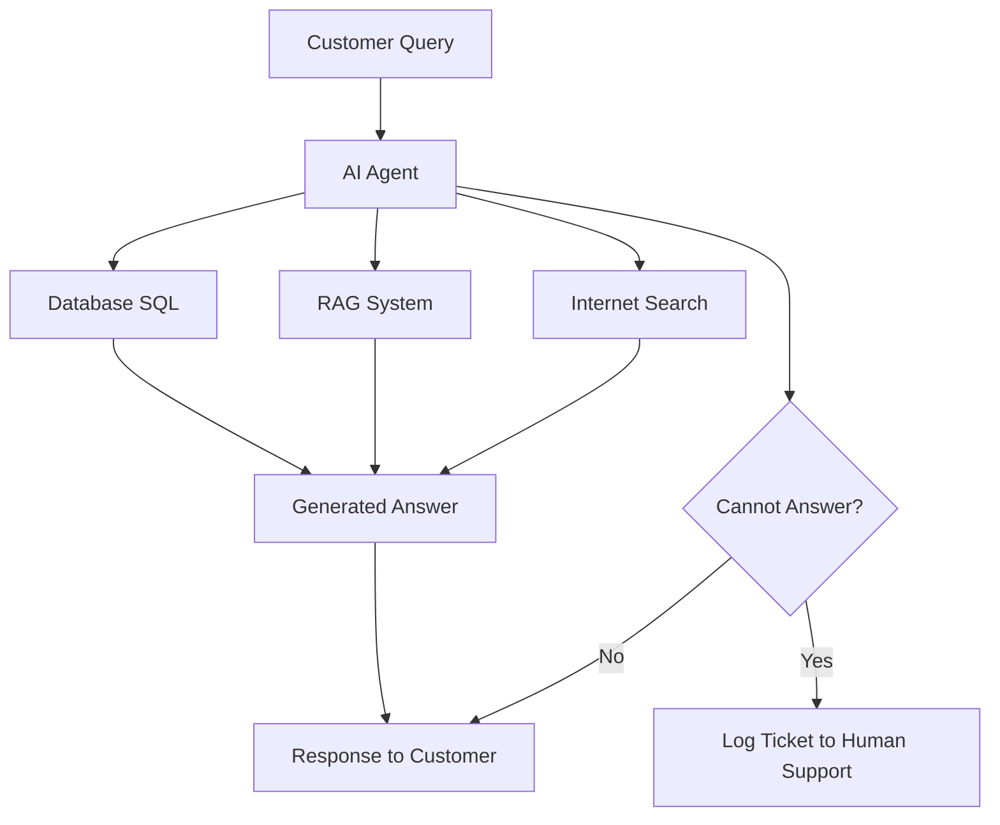

# AI Customer Support Agent

## Project Overview

This project aims to develop an intelligent AI agent designed to enhance customer support operations. The agent is capable of answering a wide range of customer queries by leveraging information from multiple sources: a structured SQL database, a Retrieval-Augmented Generation (RAG) system, and real-time internet searches. In cases where the AI agent cannot confidently answer a customer's question, it is equipped to seamlessly log a support ticket, ensuring that complex or unanswerable queries are escalated to human customer support representatives.

## Key Features

- **Multi-Source Knowledge Retrieval:** Integrates with SQL databases for structured data, a RAG system for contextual understanding and generation, and internet search for up-to-date information.
- **Intelligent Query Answering:** Processes natural language queries from customers and provides accurate and relevant responses.
- **Automated Ticket Logging:** Automatically creates support tickets for human agents when a query cannot be resolved by the AI, ensuring no customer issue goes unaddressed.
- **Scalable and Efficient:** Designed to handle a high volume of customer interactions, reducing the workload on human support staff.

## Architecture Diagram

The following diagram illustrates the high-level architecture and flow of the AI Customer Support Agent:

## Getting Started

(Detailed instructions on setting up the environment, installing dependencies, and running the agent will be added here.)

## Technologies Used

- LangChain
- LangGraph
- LangSmith
- Groq
- SQL

## Future Enhancements

